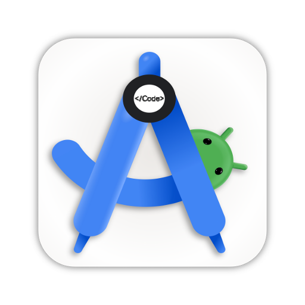

<p align="center">
  
</p>

<h2 align="center"><b>ZeroStudio</b></h2>
<p align="center">
  An IDE to develop real, Gradle-based Android applications on Android devices.
<p><br>

<p align="center">
<!-- Latest release -->

<!-- Build and test -->

<!-- CodeFactor -->

<!-- Crowdin -->
<a href="https://crowdin.com/project/ZeroStudio"></a>
<!-- License -->
</p>

<p align="center">
  <a href="https://docs.ZeroStudio.com/">Explore the docs »</a> &nbsp; &nbsp;
</p>

## Features

- [x] Gradle support.
- [x] `JDK 11` and `JDK 17` available for use.
- [x] Terminal with necessary packages.
- [x] Custom environment variables (for Build & Terminal).
- [x] SDK Manager (Available via terminal).
- [x] API information for classes and their members (since, removed, deprecated).
- [x] Log reader (shows your app's logs in real-time)
- [ ] Language servers
    - [x] Java
    - [x] XML
    - [ ] Kotlin
    - [x] lua 
- [ ] UI Designer
    - [x] Layout inflater
    - [x] Resolve resource references
    - [x] Auto-complete resource values when user edits attributes using the attribute editor
    - [x] Drag & Drop
    - [x] Visual attribute editor
    - [x] Android Widgets
- [ ] String Translator
- [ ] Asset Studio (Drawable & Icon Maker)
- [x] Git

## Installation
[](https://github.com/android_zeros/ZeroStudio/releases)

> _Please install ZeroStudio from trusted sources only i.e._
> - [_GitHub Releases_](https://github.com/android_zeros/ZeroStudio/releases)
> - [_GitHub Actions_](https://github.com/android_zeros/ZeroStudio/actions?query=branch%3Adev+event%3Apush)
<!-- > - [_F-Droid_](https://f-droid.org/packages/com.itsaky.ZeroStudio/) -->

- Download the ZeroStudio APK from the mentioned trusted sources.
- Follow the
  instructions [here](https://docs.ZeroStudio.com/tutorials/get-started.html) to
  install the build tools.

## Limitations

- For working with projects in ZeroStudio, your project must use Android Gradle Plugin v7.2.0 or
  newer. Projects with older AGP must be migrated to newer versions.
- SDK Manager is already included in Android SDK and is accessible in ZeroStudio via its Terminal.
  But, you cannot use it to install some tools (like NDK) because those tools are not built for
  Android.
- No official NDK support because we haven't built the NDK for Android.

The app is still being developed actively. It's in beta stage and may not be stable. if you have any
issues using the app, please let us know.

## Contributing

See the [contributing guide](./CONTRIBUTING.md).

For translations, visit the [Crowdin project page](https://crowdin.com/project/ZeroStudio).

## Thanks to

- [Rosemoe](https://github.com/Rosemoe) for the
  awesome [CodeEditor](https://github.com/Rosemoe/sora-editor)
- [Termux](https://github.com/termux) for [Terminal Emulator](https://github.com/termux/termux-app)
- [Bogdan Melnychuk](https://github.com/bmelnychuk)
  for [AndroidTreeView](https://github.com/bmelnychuk/AndroidTreeView)
- [George Fraser](https://github.com/georgewfraser) for
  the [Java Language Server](https://github.com/georgewfraser/java-language-server)

Thanks to all the developers who have contributed to this project.


## Contact Us
- [Telegram channel](https://t.me/android_zero_studio)
- [Telegram issues(https://t.me/zerostudio_issues)
- [QQ group(https://qm.qq.com/q/FjC6t6XSsU)

<p align="center">
  <a href="https://github.com/android_zeros/ZeroStudio/issues/new?labels=bug&template=BUG.yml&title=%5BBug%5D%3A+">Report a bug</a> &nbsp; &#8226; &nbsp;
  <a href="https://github.com/android_zeros/ZeroStudio/issues/new?labels=feature&template=FEATURE.yml&title=%5BFeature%5D%3A+">Request a feature</a> &nbsp; &#8226; &nbsp;
  <!-- <a href="https://qm.qq.com/q/FjC6t6XSsU">Join the QQ group</a> -->
  <!-- <a href="https://t.me/android_zero_studio">Join us on Telegram</a> -->
</p>


## Disclaimers（免责声明）

> [!WARNING]
> **重要免责声明：请在使用前仔细阅读**
>
> 1.  使用本 IDE 也就是 `ZeroStudio` 构建的任何工程项目均**与 `ZeroStudio` 无关**。
>
> 2.  基于第一条，严禁使用 `ZeroStudio` 开发任何**破坏、损坏计算机与互联网的各类病毒、木马**（包括但不限于任何锁机、银行木马、盗窃、控制等各种类型的恶意程序），或用于**修改、破坏系统**。任何此类行为产生的后果**均与 `ZeroStudio` 无任何关系**，请各位开发者悉知！
>
> 3.  任何个人或团体因使用 `ZeroStudio` 而产生的**一切法律责任**，均由使用者自行承担，**与 `ZeroStudio` 作者 `github/android_zeros` 无任何关系**。请在**遵守当地及国家相关法律法规**的前提下，在合理范围内使用本工具。

> [!NOTE]
> 本 IDE 开源且透明，所有使用者必须知晓并同意上述免责声明。请务必在合法、合理的范围内使用。

---

## Disclaimer (English Translation)

> [!WARNING]
> **Important Disclaimer: Please read carefully before use**
>
> 1.  Any project built using this IDE, `ZeroStudio` [https://github.com/android_zeros/ZeroStudio], is **not related to `ZeroStudio`**.
>
> 2.  In accordance with the first rule, it is strictly forbidden to use `ZeroStudio` to develop any **viruses or Trojans that damage computers and the internet** (including but not limited to any ransomware, banking Trojans, theft, remote control, and other types of malicious software), or to **modify or damage systems**. Any consequences arising from such actions have **nothing to do with `ZeroStudio`**. All developers, please be aware!
>
> 3.  Any **legal liability** arising from the use of the `ZeroStudio` IDE by individuals or groups is the sole responsibility of the user and **has nothing to do with the creator of `ZeroStudio`**, `github/android_zeros` [https://github.com/android_zeros]. Please use this tool within a reasonable scope and in **compliance with all local and national laws and regulations**.

> [!NOTE]
> This IDE is open source and transparent. All users must acknowledge and agree to the above disclaimer. Please ensure your use is lawful and reasonable.

## License

```
ZeroStudio is free software: you can redistribute it and/or modify
it under the terms of the GNU General Public License as published by
the Free Software Foundation, either version 3 of the License, or
(at your option) any later version.

ZeroStudio is distributed in the hope that it will be useful,
but WITHOUT ANY WARRANTY; without even the implied warranty of
MERCHANTABILITY or FITNESS FOR A PARTICULAR PURPOSE.  See the
GNU General Public License for more details.

In addition, all code and code snippets in this project 'ZeroStudio', regardless of whether they are modified or added, shall not be used for any commercial purposes and various charging scenarios, not limited to donations, donations, etc., and then the use of installation packages and code snippets distributed by this project shall not add restrictions, including but not limited to viewing advertisements, etc., this project 'ZeroStudio' is completely free in nature, so it does not support any commercial use, how to charge, revenue and other restrictions. Any features in it need to be supported for accessibility

You should have received a copy of the GNU General Public License
along with ZeroStudio.  If not, see <https://www.gnu.org/licenses/>.
```

Any violations to the license can be reported either by opening an issue or writing a mail to us
directly.
